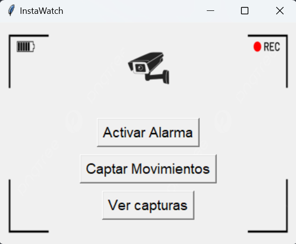

# Sistema de Videovigilancia en Python

## Descripción
Sistema de videovigilancia en Python con interfaz gráfica, que detecta movimiento y responde con una alarma sonora o captura de imágenes.

## Instrucciones de Uso

Interfaz Gráfica:
Ejecuta main.py para abrir la interfaz gráfica.

`python main.py`

En la GUI verás tres botones:
- Activar Alarma: Inicia la detección de movimiento con alarma sonora.
- Captar Movimientos: Inicia la captura de imágenes al detectar movimiento, guardándolas en la carpeta grabaciones.
- Ver capturas: Abre la carpeta con las capturas realizadas.

Detener el Sistema:
Cierra la ventana o presiona q en las vistas de video para detener la detección de movimiento o las capturas.

## Requisitos
Instala las dependencias:
`pip install opencv-python pillow numpy`
